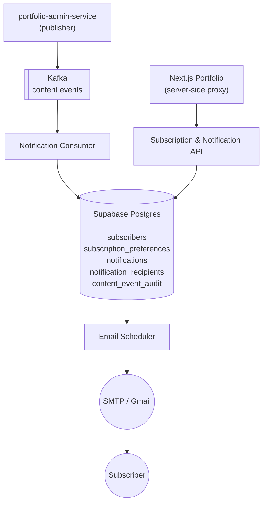

# portfolio-notification-service

The notification plane behind [yuqi.site](https://www.yuqi.site). Owns
**subscribers, subscription preferences, notification fan-out, and email
delivery** for content published by the admin platform.

Single Spring Boot 3.3 service. Stateless on the request path; durable on
Kafka and Supabase Postgres. Email is delivered out-of-band by a scheduled
worker reading from `notification_recipients`.

---

## Architecture



**Design properties:**

1. **REST and Kafka write the same tables, idempotently.** Inserts into
   `notifications` carry an idempotency key derived from the content event
   (`{sourceType}:{sourceId}:v{version}`). A second delivery is dropped at
   the DB layer (`ON CONFLICT DO NOTHING`).
2. **Manual Kafka acks + DLQ.** `enable-auto-commit: false`,
   `ack-mode: manual`, `missing-topics-fatal: false`. The consumer only
   acks after the processor returns `OK`. On a parsing failure it produces
   to `portfolio.dlq` and acks (poison-pill isolation).
3. **Email is fully decoupled from the publish path.** Consumer writes
   `notification_recipients` rows in state `READY`; a scheduled worker
   claims a batch, sends via SMTP, and updates state. SMTP outages do not
   block Kafka consumption.
4. **Shared-secret edge.** All `/api/subscriptions/**` and
   `/api/notifications/**` calls require `X-Internal-Token`. Browsers
   never see this header — the Next.js portfolio injects it server-side
   in its API routes. Swagger UI is gated separately by a Supabase JWT.

---

## Surface responsibilities

| Surface                                | Owner                  |
|----------------------------------------|------------------------|
| Subscription CRUD (subscribe / unsub)  | `SubscriptionController` |
| Subscription preferences               | `SubscriptionController` |
| Notification feed for a subscriber     | `NotificationController` |
| Mark notification read                 | `NotificationController` |
| Health check (DB + Kafka)              | `HealthController` (`/api/health/notification`) + `/actuator/health` |
| Kafka consume → DB fan-out             | `ContentEventConsumer` + `ContentEventProcessor` |
| HTTP fallback for content events       | `ContentEventController` (`POST /api/content-events`) |
| Email delivery worker                  | `EmailScheduler`         |
| Dead-letter publishing                 | `DlqProducer`            |

---

## Event contract

Inbound events match `portfolio-admin-service`'s `ContentPublishedEvent`:

```json
{
  "eventId":     "uuid",
  "occurredAt":  "2026-06-21T05:00:00Z",
  "sourceType":  "BLOG | LIFE_BLOG | PROJECT | EXPERIENCE",
  "sourceId":    "uuid-or-bigint-as-text",
  "version":     3,
  "title":       "...",
  "summary":     "...",
  "slug":        "...",
  "publishedAt": "..."
}
```

**Topic mapping (admin → notification):**

| `sourceType`               | Logical channel       | Admin-side topic                                   |
|----------------------------|-----------------------|----------------------------------------------------|
| `BLOG`, `LIFE_BLOG`        | `ARTICLE_UPDATES`     | `content.notification.article-updates.v1`          |
| `PROJECT`                  | `FEATURE_UPDATES`     | `content.notification.feature-updates.v1`          |
| `EXPERIENCE`               | `JOB_UPDATES`         | `content.notification.job-updates.v1`              |

> The consumer in this repo currently listens to
> **`portfolio.content-events`** (the legacy single-topic stream).
> Migration to subscribe to all three `content.notification.*.v1` topics is
> tracked as part of the admin platform rollout — change is a one-line
> `topics = { ... }` update in `ContentEventConsumer` plus the matching
> consumer-group ACL on Aiven.

---

## Data model (Supabase, owned by this service)

| Table                       | Purpose                                                                                            |
|-----------------------------|----------------------------------------------------------------------------------------------------|
| `subscribers`               | Email + `unsubscribe_token_hash` (HMAC peppered) + `status`                                       |
| `subscription_preferences`  | `(subscriber_id, channel)` → `enabled` for each of `ARTICLE_UPDATES`, `FEATURE_UPDATES`, `JOB_UPDATES` |
| `notifications`             | One row per published content event, `idempotency_key` UNIQUE                                      |
| `notification_recipients`   | Fan-out join: `(notification_id, subscriber_id, state)` with state machine `READY → SENT / FAILED / SKIPPED` |
| `content_event_audit`       | Append-only — every consumed Kafka event lands here for observability                              |

All migrations live in `src/main/resources/db/migration/` and are applied
by Flyway on startup (`baseline-on-migrate: true`, `baseline-version: 0`).

---

## REST API

All `/api/subscriptions/**` and `/api/notifications/**` endpoints require:

```
X-Internal-Token: <INTERNAL_API_TOKEN>
```

| Method | Path                                              | Notes                                                          |
|--------|---------------------------------------------------|----------------------------------------------------------------|
| POST   | `/api/subscriptions`                              | `{email, channels?: [...]}` — upsert + welcome email           |
| GET    | `/api/subscriptions/preferences?email=`           | Returns current channel toggles                                |
| PUT    | `/api/subscriptions/preferences`                  | `{email, channels: {ARTICLE_UPDATES:true, ...}}`               |
| POST   | `/api/subscriptions/unsubscribe`                  | `{token}` — one-click unsubscribe (token from the email)       |
| GET    | `/api/notifications?email=&unreadOnly=&limit=`    | Subscriber notification feed                                   |
| POST   | `/api/notifications/{id}/read`                    | Mark single notification read                                  |
| POST   | `/api/content-events`                             | HTTP fallback that mimics a Kafka event (admin-only)           |
| GET    | `/api/health/notification`                        | Composite health (DB + Kafka), no auth                         |
| GET    | `/actuator/health`                                | Spring health, no auth                                         |
| GET    | `/swagger-ui.html`                                | Gated by Supabase JWT (see ["Accessing Swagger UI"](#accessing-swagger-ui)) |

---

## Accessing Swagger UI

Swagger UI is locked behind a Supabase JWT — there is no separate Swagger
login form. The flow uses the same Supabase session that drives the Portfolio
admin panel and Mr. Pot chat widget:

1. Open <https://www.yuqi.site> and sign in using the embedded login dialog
   (top-right user icon, or the Mr. Pot chat widget). Only emails in
   `SWAGGER_ALLOWED_EMAILS` can pass step 3.
2. Open browser DevTools → Console and grab the access token. On the live
   site it is exposed under `window.supabase`:
   ```js
   (await window.supabase?.auth.getSession?.())?.data?.session?.access_token
   ```
   If `window.supabase` is not available, copy the token from the
   `sb-<project-ref>-auth-token` cookie value (it is the `access_token`
   field of the JSON payload).
3. Open <https://portfolio-notification-service-y45c2mnbja-uc.a.run.app/swagger-ui.html>,
   click **Authorize**, and paste `Bearer <token>`. Re-authorize when the
   token expires (default ≈ 1 h).

These Spring endpoints are the HTTP target layer for the Portfolio admin
pages and the Mr. Pot chat widget MCP tools:

| Spring endpoint                                  | Portfolio proxy                                  | Chat widget MCP tool      |
|--------------------------------------------------|--------------------------------------------------|---------------------------|
| `POST /api/subscriptions`                        | `POST /api/subscriptions`                        | `subscription.create`     |
| `PATCH /api/subscriptions/preferences`           | `PATCH /api/subscriptions/preferences`           | `subscription.update`     |
| `POST /api/subscriptions/unsubscribe`            | `POST /api/subscriptions/unsubscribe`            | `subscription.unsubscribe`|
| `GET /api/notifications`                         | `GET /api/notifications`                         | `notification.list`       |
| `PATCH /api/notifications/{id}/read`             | `PATCH /api/notifications/{id}/read`             | `notification.markRead`   |
| `GET /api/health/notification`                   | `GET /api/health/notification`                   | `health.notification`     |
| `POST /api/content-events`                       | `POST /api/admin/publish-event` (Supabase-gated) | `content.publish`         |

---

## Runtime topology (production)

| Concern              | Choice                                                                                                |
|----------------------|-------------------------------------------------------------------------------------------------------|
| Compute              | Cloud Run (managed), region `us-central1`, project `portfolio-notify-prod`                            |
| Image registry       | `us-central1-docker.pkg.dev/portfolio-notify-prod/portfolio/portfolio-notification-service`           |
| Runtime SA           | `notification-runtime@portfolio-notify-prod.iam.gserviceaccount.com`                                  |
| CI SA / federation   | `ci-deployer@…` via GitHub OIDC → Workload Identity Federation                                        |
| Database             | Supabase Postgres 15, **IPv6-only DNS**                                                               |
| Bus                  | Aiven Kafka (SASL_SSL + SCRAM-SHA-256, PEM CA in `KAFKA_CA_CERT`)                                     |
| Email                | Gmail SMTP, app-password authenticated, STARTTLS on 587                                               |
| Public URL           | <https://portfolio-notification-service-y45c2mnbja-uc.a.run.app>                                      |

### Networking gotcha — Supabase is IPv6-only

Free-tier `db.<ref>.supabase.co` publishes only an `AAAA` record. The JVM
default prefers IPv4 and fails with `UnknownHostException`. The Dockerfile
must include:

```dockerfile
ENV JAVA_OPTS="-XX:+UseG1GC -XX:MaxRAMPercentage=75 -Djava.net.preferIPv6Addresses=true"
```

---

## Configuration

| Variable                       | Source        | Notes                                                                 |
|--------------------------------|---------------|-----------------------------------------------------------------------|
| `SPRING_DATASOURCE_URL`        | secret        | `jdbc:postgresql://db.<ref>.supabase.co:5432/postgres?sslmode=require` |
| `SPRING_DATASOURCE_USERNAME`   | secret        |                                                                       |
| `SPRING_DATASOURCE_PASSWORD`   | secret        |                                                                       |
| `KAFKA_BOOTSTRAP_SERVERS`      | env           | Aiven `host:port`                                                     |
| `KAFKA_SECURITY_PROTOCOL`      | env           | `SASL_SSL`                                                            |
| `KAFKA_SASL_MECHANISM`         | env           | `SCRAM-SHA-256`                                                       |
| `KAFKA_SASL_JAAS_CONFIG`       | env           | Built at deploy from `KAFKA_USERNAME` + `KAFKA_PASSWORD`              |
| `KAFKA_TRUSTSTORE_TYPE`        | env           | `PEM`                                                                 |
| `KAFKA_CA_CERT`                | secret        | Aiven CA in PEM                                                       |
| `KAFKA_TOPIC_CONTENT_EVENTS`   | env           | default `portfolio.content-events`                                    |
| `KAFKA_TOPIC_DLQ`              | env           | default `portfolio.dlq`                                               |
| `MAIL_HOST` / `MAIL_PORT`      | env           | `smtp.gmail.com` / `587`                                              |
| `MAIL_USERNAME` / `MAIL_PASSWORD` | secret     | App password                                                          |
| `INTERNAL_API_TOKEN`           | secret        | Shared with Next.js portfolio proxy                                   |
| `TOKEN_PEPPER`                 | secret        | Used to derive `unsubscribe_token_hash`                               |
| `SUPABASE_JWT_SECRET`          | secret        | Gates Swagger UI                                                      |
| `SWAGGER_ALLOWED_EMAILS`       | env           | Comma-separated email allow-list for Swagger                          |
| `GOOGLE_CLIENT_ID`             | env           | Optional `aud` check on Google ID tokens                              |
| `PORTFOLIO_BASE_URL`           | env           | `https://www.yuqi.site` — used in email links                         |
| `ALLOWED_ORIGINS`              | env           | CORS allow-list                                                       |

---

## Quickstart (local)

```bash
# 1. Start a Kafka broker (optional — set portfolio.kafka.consumer-enabled=false to skip)
docker run --rm -p 9092:9092 apache/kafka:3.7.0

# 2. Point at Supabase
export SPRING_DATASOURCE_URL='jdbc:postgresql://db.<ref>.supabase.co:5432/postgres?sslmode=require'
export SPRING_DATASOURCE_USERNAME='postgres'
export SPRING_DATASOURCE_PASSWORD='...'

# 3. SMTP + shared secrets
export MAIL_USERNAME='yuqi.guo17@gmail.com'
export MAIL_PASSWORD='<gmail app password>'
export INTERNAL_API_TOKEN='dev-internal-token-change-me'
export TOKEN_PEPPER='dev-only-pepper-change-me'

mvn -DskipTests spring-boot:run       # serves on :8080
```

Smoke:

```bash
# Subscribe
curl -sX POST \
  -H "X-Internal-Token: $INTERNAL_API_TOKEN" -H 'Content-Type: application/json' \
  -d '{"email":"you@example.com"}' \
  http://localhost:8080/api/subscriptions | jq .

# Simulate a content event via HTTP fallback
curl -sX POST \
  -H "X-Internal-Token: $INTERNAL_API_TOKEN" -H 'Content-Type: application/json' \
  -d '{"sourceType":"BLOG","sourceId":"123","version":1,"title":"Hello","summary":"...","slug":"hello"}' \
  http://localhost:8080/api/content-events
```

Expected:

- 1 row in `subscribers`, 3 rows in `subscription_preferences`
- 1 row in `notifications` (idempotent on retry)
- N rows in `notification_recipients` (one per matching subscriber, `state=READY`)
- After the scheduler tick: `state=SENT` and an email in the inbox

---

## CI / deploy

Workflow: `.github/workflows/deploy.yml`. Triggered on push to `main` and
via `workflow_dispatch`. Steps mirror the admin platform pipeline:

1. `mvn -B -DskipTests package`
2. `docker buildx build` + push to Artifact Registry
3. `gcloud run deploy portfolio-notification-service --image ... --update-secrets ... --set-env-vars ...`
4. Smoke check on `/actuator/health`

### Required GitHub Actions variables

| Variable                      | Example                                                                                              |
|-------------------------------|------------------------------------------------------------------------------------------------------|
| `GCP_PROJECT_ID`              | `portfolio-notify-prod`                                                                              |
| `GCP_REGION`                  | `us-central1`                                                                                        |
| `ARTIFACT_REPO`               | `portfolio`                                                                                          |
| `WIF_PROVIDER`                | `projects/702193211434/locations/global/workloadIdentityPools/github-pool/providers/github-provider` |
| `DEPLOYER_SA_EMAIL`           | `ci-deployer@portfolio-notify-prod.iam.gserviceaccount.com`                                          |
| `NOTIFY_RUNTIME_SA_EMAIL`     | `notification-runtime@portfolio-notify-prod.iam.gserviceaccount.com`                                 |
| `PORTFOLIO_BASE_URL`          | `https://www.yuqi.site`                                                                              |
| `ALLOWED_ORIGINS`             | `https://www.yuqi.site,http://localhost:3000`                                                        |
| `SWAGGER_ALLOWED_EMAILS`      | `yuqi.guo17@gmail.com`                                                                               |

### Required Secret Manager entries

`SPRING_DATASOURCE_URL`, `SPRING_DATASOURCE_USERNAME`, `SPRING_DATASOURCE_PASSWORD`,
`KAFKA_BROKERS`, `KAFKA_USERNAME`, `KAFKA_PASSWORD`, `KAFKA_CA_CERT`,
`MAIL_USERNAME`, `MAIL_PASSWORD`, `INTERNAL_API_TOKEN`, `TOKEN_PEPPER`,
`SUPABASE_JWT_SECRET`, `GOOGLE_CLIENT_ID`.

---

## Security model

- **All write paths** require `X-Internal-Token` — generated with
  `openssl rand -hex 32` and shared **only** with the Next.js portfolio
  server-side proxy. Never expose to a browser.
- **Unsubscribe tokens** are stored hashed (HMAC-SHA-256 with `TOKEN_PEPPER`).
  The raw token only exists in the recipient's email.
- **Swagger UI** is locked behind a Supabase JWT (or Google ID token,
  optionally audience-checked against `GOOGLE_CLIENT_ID`). Access is
  further restricted to `SWAGGER_ALLOWED_EMAILS`.
- **Kafka** uses SASL_SSL + SCRAM-SHA-256. The PEM CA cert is the only
  trust anchor; no system trust store fallback.
- **No service account JSON keys** anywhere — CI uses Workload Identity
  Federation, the runtime uses its attached service account.

---

## Operational runbook

### Container starts but logs `UnknownHostException: db.<ref>.supabase.co`

Supabase is IPv6-only on the free tier. Verify the Dockerfile carries
`-Djava.net.preferIPv6Addresses=true` and that Cloud Run has IPv6 egress
(`gcloud run services describe ... --format='value(spec.template.metadata.annotations)'`
should NOT pin `run.googleapis.com/network-interfaces` to an IPv4-only VPC).

### Container starts then fails with `org.apache.kafka.common.errors.TopicAuthorizationException` or `UnknownTopicOrPartitionException`

We deliberately set `missing-topics-fatal: false` so the service stays up
and serves REST traffic even when Kafka is mis-configured. Create the
topic on Aiven (or wait for the producer to auto-create it), grant the
consumer group `Read` on the topic and `Read`/`Describe` on the consumer
group ACL, and consumption resumes without a restart.

### `JsonDeserializer must be configured with property setters, or via configuration properties; not both`

Same fix as the admin platform — do not mix `new JsonDeserializer<>(...)`
constructor + `addTrustedPackages()` setters with `spring.json.*` keys.
Pass deserializer **classes** only and let Spring Kafka build them from
properties. See `KafkaConsumerConfig`.

### Flyway "Migration checksum mismatch" / "description mismatch"

Either run `mvn flyway:repair` against the target DB, or update
`flyway_schema_history` manually:

```sql
UPDATE public.flyway_schema_history
   SET checksum    = <new>,
       description = '<exact description from V*__file.sql>',
       script      = '<exact filename>'
 WHERE version = '<n>';
```

Note: Spring Boot 3.3 with Flyway 10 supports `spring.flyway.baseline-on-migrate`
and `spring.flyway.baseline-version`, but **not**
`spring.flyway.repair-on-migration-checksum-mismatch`. Repair is a manual
step.

### Email is queued but never sent

```bash
# 1. Confirm rows are landing in notification_recipients with state=READY
psql "$SPRING_DATASOURCE_URL" -c \
  "SELECT state, count(*) FROM notification_recipients GROUP BY 1;"

# 2. Tail the scheduler
gcloud logging tail \
  'resource.type="cloud_run_revision"
   AND resource.labels.service_name="portfolio-notification-service"
   AND textPayload=~"EmailScheduler|smtp"' \
  --project=portfolio-notify-prod
```

Common causes: Gmail revoked the app password, `MAIL_USERNAME` ≠ the From
address Gmail expects, or the scheduler thread is paused because of an
earlier exception in a batch (rows will sit at `state=FAILED` with
`last_error` populated — reset to `READY` to re-attempt).

### Inspect the DLQ

```bash
kafkacat -b $KAFKA_BROKERS -X security.protocol=SASL_SSL \
  -X sasl.mechanisms=SCRAM-SHA-256 \
  -X sasl.username=$KAFKA_USERNAME -X sasl.password=$KAFKA_PASSWORD \
  -X ssl.ca.location=ca.pem \
  -C -t portfolio.dlq -o beginning -e
```

A poison-pill payload landing in `portfolio.dlq` always means a producer
shape change. Fix the producer (admin-service) or evolve
`ContentPublishedEvent` here with a backwards-compatible default.

### Rollback

```bash
gcloud run services update-traffic portfolio-notification-service \
  --region=us-central1 \
  --to-revisions=portfolio-notification-service-<NN>-<hash>=100
```

---

## Things this service intentionally does NOT do

- ❌ Author content (that's `portfolio-admin-service`)
- ❌ Render an admin UI
- ❌ Send transactional email outside the publish/unsubscribe flows (no welcome drips, no marketing)
- ❌ Allow browser-direct writes — every `/api/subscriptions/**` call must come through the Next.js server proxy

---

## Companion repos

- [`portfolio-admin-service`](https://github.com/YuqiGuo105/portfolio-admin-service) — publisher of `content.notification.*.v1` events
- [`Portfolio`](https://github.com/YuqiGuo105/Portfolio) — Next.js frontend + the server-side proxy that injects `X-Internal-Token`

---

## Repo layout

```
.
├── src/main/java/site/yuqi/notifications/
│   ├── NotificationsApplication.java
│   ├── controller/      REST endpoints (Subscription, Notification, Health, ContentEvent)
│   ├── service/         ContentEventProcessor, EmailScheduler, SubscriptionService
│   ├── kafka/           ContentEventConsumer, DlqProducer, KafkaConsumerConfig
│   ├── domain/          JPA entities for the 5 tables above
│   ├── security/        InternalTokenFilter + SwaggerAuthFilter
│   └── config/          Web/CORS/OpenAPI/SchedulingConfig
├── src/main/resources/
│   ├── application.yml
│   └── db/migration/    Flyway V*__*.sql
├── Dockerfile
└── .github/workflows/deploy.yml
```
